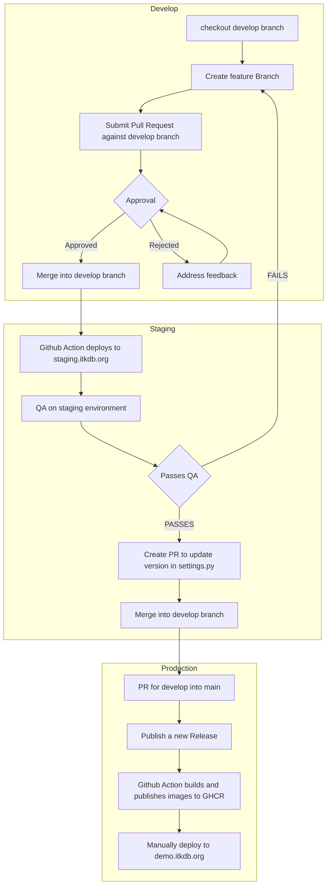

# TEKDB 

Traditional Ecological Knowledge Ethnographic Database Application

## [Development Installation](https://github.com/Ecotrust/TEKDB/wiki/Development-Installation) 

## [Running Tests](https://github.com/Ecotrust/TEKDB/wiki/Running-tests)

## CI/CD 

This project has a few Github actions that run to have continous integration / continuous deployment with our environments. Below is a diagram on the path to production:

