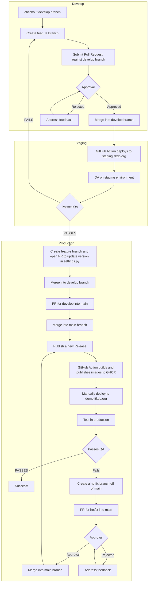

# TEKDB 

Traditional Ecological Knowledge Ethnographic Database Application

## [Development Installation](https://github.com/Ecotrust/TEKDB/wiki/Development-Installation) 

## [Running Tests](https://github.com/Ecotrust/TEKDB/wiki/Running-tests)

## Development Cycle

This project aims to follow a specific development cycle to ease collaboration and keep the different environments in sync. Below is a diagram of what the development lifecycle should look like:

